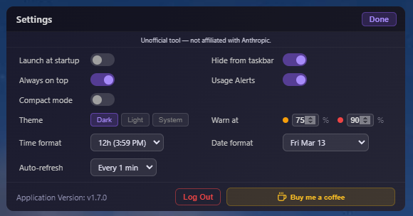

# Claude Usage Widget

A beautiful, standalone desktop widget for **Windows, macOS, and Linux** that displays your Claude.ai usage statistics in real-time.


---

## Features

🎯 **Real-time Usage Tracking** — Monitor both session and weekly usage limits  
📊 **Visual Progress Bars** — Clean, gradient progress indicators with configurable warning thresholds  
⏱️ **Countdown Timers** — Circular timers showing time elapsed in the current session window  
🔄 **Auto-refresh** — Updates every 5 minutes automatically, with animated refresh indicator  
📈 **Usage History Graph** — Toggleable 7-day chart showing session and weekly trends over time  
🌍 **Currency Support** — Extra usage displays your account's billing currency (€, £, $)  
🎨 **Modern UI** — Sleek, draggable widget with dark and light themes  
🔒 **Secure** — Encrypted credential storage  
📍 **Always on Top** — User-controlled, stays visible across all workspaces  
💾 **System Tray** — Minimizes to tray for easy access  
🪟 **Taskbar Icon (Windows)** — Session and weekly usage on the taskbar icon itself, split into two panels, showing the live percentage (off by default — opt in via Settings)  
⚙️ **Settings Panel** — Persistent preferences for startup, theme, tray, thresholds, and date/time formats  
🔔 **Usage Alerts** — Desktop notifications when usage crosses configurable warn/danger thresholds  
🔔 **Update Notifications** — Automatic check for new releases on startup  
🕐 **Configurable Date & Time Formats** — 12h/24h time, and flexible weekly reset date display  
📐 **Compact Mode** — Minimal view for when you just need a quick glance  
🧩 **Per-Model Breakdowns** — Rows and chart lines for Sonnet, Opus, Fable, Cowork, OAuth Apps, and Design usage when your account reports them  
💳 **Credit Clarity** — Monthly spend cap and credit balance shown separately, with a promo-vs-purchased split and expiry warnings  
👥 **Multi-Account Support** — Run isolated instances for separate accounts via the `--profile` flag (see below)  

> For a full history of changes by version, see [Release Notes](RELEASE_NOTES_1.7.X.md).

---

## Screenshots

### Settings Panel




### Settings Options

- ⚙️ **Launch at startup** — Auto-start with Windows or macOS login
- 📌 **Hide from taskbar** — Tray-only mode (requires tray stats)
- 💾 **Show tray stats** — Dual system tray icons with live session/weekly percentages (Windows)
- 🪟 **Show taskbar stats** — Session and weekly usage on the taskbar icon, split left/right (Windows, off by default)
- 🎨 **Theme selector** — Dark / Light / System
- ⚠️ **Warning thresholds** — Configurable amber and red levels for usage bars
- 🔔 **Usage alerts** — Desktop notifications at warn/danger thresholds
- 🕐 **Time format** — 12h or 24h
- 📅 **Date format** — Controls how the weekly reset date is displayed
- 📐 **Compact mode** — Minimal view

---

## Installation

### Download Pre-built Release

**Windows:**
1. Download the latest `Claude-Usage-Widget-{version}-win-Setup.exe` (installer) or `Claude-Usage-Widget-{version}-win-portable.exe` (no install needed) from [Releases](../../releases)
2. Run the installer or portable exe
3. Launch "Claude Usage Widget" from the Start Menu (installer) or directly (portable)
4. **To launch at Windows startup (portable only):** Press `Win+R`, type `shell:startup`, and copy the portable `.exe` into that folder. To update, copy the new version in and delete the old one.

**macOS:**
1. Download the latest `Claude-Usage-Widget-{version}-macOS-arm64.dmg` (Apple Silicon) or `Claude-Usage-Widget-{version}-macOS-x64.dmg` (Intel) from [Releases](../../releases)
2. Open the DMG and drag the app to your Applications folder
3. Launch "Claude Usage Widget" from Applications

> **Note:** The app is signed and notarized. If macOS still shows a warning on first launch, run:
> ```
> xattr -cr /Applications/Claude\ Usage\ Widget.app
> ```

**Linux:**
1. Download the latest `Claude-Usage-Widget-{version}-linux-x86_64.AppImage` (Intel/AMD) or `Claude-Usage-Widget-{version}-linux-arm64.AppImage` (ARM) from [Releases](../../releases)
2. Make it executable: `chmod +x Claude-Usage-Widget-*.AppImage`
3. Run it: `./Claude-Usage-Widget-*.AppImage`

> **Note:** AppImage runs without installation on most Linux distributions. On Ubuntu 22.04+, you may need to install a dependency first:
> ```bash
> sudo apt install libfuse2
> ```

#### Linux: Desktop Launcher & Autostart (optional)

By default the AppImage runs from wherever you put it. To get a clickable icon in your app launcher (and optionally launch at login), follow these steps.

**1. Place the AppImage somewhere permanent:**
```bash
mkdir -p ~/.local/bin
mv Claude-Usage-Widget-*.AppImage ~/.local/bin/claude-usage-widget.AppImage
chmod +x ~/.local/bin/claude-usage-widget.AppImage
```

**2. Create a desktop entry:**
```bash
cat > ~/.local/share/applications/claude-usage-widget.desktop << EOF
[Desktop Entry]
Name=Claude Usage Widget
Comment=Monitor Claude.ai usage
Exec=$HOME/.local/bin/claude-usage-widget.AppImage --no-sandbox
Icon=$HOME/.local/bin/claude-usage-widget.AppImage
Terminal=false
Type=Application
Categories=Utility;
StartupNotify=true
EOF
```

> **Note:** The `--no-sandbox` flag is required for Electron-based AppImages on most Linux systems due to sandbox namespace restrictions. This is an Electron/Chrome limitation, not specific to this widget.

**3. Register the entry:**
```bash
update-desktop-database ~/.local/share/applications/
```

The widget should now appear in your application launcher. Test it by launching from your app menu before proceeding to autostart.

**4. Autostart at login (optional):**
```bash
mkdir -p ~/.config/autostart
cp ~/.local/share/applications/claude-usage-widget.desktop ~/.config/autostart/
```

---

### Build from Source

**Prerequisites:**
- Node.js 18+ ([Download](https://nodejs.org))
- npm (comes with Node.js)

```bash
git clone https://github.com/SlavomirDurej/claude-usage-widget.git
cd claude-usage-widget
npm install
npm start
```


---

## Usage

### First Launch

1. Launch the widget
2. Click "Login to Claude" when prompted
3. A browser window will open — log in to your Claude.ai account
4. The widget will automatically capture your session
5. Usage data will start displaying immediately

### Widget Controls

- **Drag** — Click and drag the title bar to move the widget
- **Refresh** — Click the refresh icon to update data immediately
- **Graph** — Click the graph icon to toggle usage history
- **Minimize** — Click the minus icon to tuck the widget away. By default it minimizes normally (the taskbar/tray icon stays visible as the way back in); with "Hide from taskbar" on, it hides fully to the system tray instead.
- **Close** — Click the X to close the app entirely (same as Alt+F4, or "Close window" from the taskbar icon's right-click menu)

### System Tray

Right-click the tray icon for: Show/Hide, Refresh, Re-login, Settings, Exit.

### Taskbar Icon (Windows)

Opt in via Settings → "Show taskbar stats" (off by default) to show session and weekly usage directly on the taskbar icon: split into left (session) and right (weekly) panels, colored by threshold the same way the tray icons and progress bars are, with a white X at 99–100%. Click the icon to toggle the main window, same as before. Requires "Hide from taskbar" to be off, since that setting removes the taskbar presence entirely in favor of tray-only mode.

### Multi-Account Support (Advanced)

Launch with `--profile=<name>` to run a fully isolated instance — its own session, cookies, and settings — so you can track two Claude accounts side by side without them interfering.

Example: `claude-usage-widget --profile=work`

Profile names are sanitized to `[a-zA-Z0-9_-]` — anything else (including `.`) becomes `_`, so `--profile=jane.doe` resolves to the same profile as `--profile=jane_doe`. Worth knowing before assuming two different profile names you've typed are actually two different profiles.

This is a power-user feature, tested by us but not yet broadly validated by the community — if you hit issues, please open a GitHub Discussion.

### Recovering a Stuck Taskbar Icon (Windows, Advanced)

If a Windows taskbar icon gets stuck showing a stale or generic icon and won't update no matter what — even after a reboot — the cause is usually Windows Shell state cached against the app's identity (AppUserModelID), not a bug in the running app. `--reset-aumid` gives that identity a fresh, never-before-seen value without needing a new profile:

```
claude-usage-widget --reset-aumid                    # resets the default profile
claude-usage-widget --profile=work --reset-aumid      # resets a specific profile
```

This exits immediately after saving the new identity — it doesn't launch the app. Relaunch normally afterward for it to take effect. Any taskbar pin made before the reset will need to be re-pinned, since Windows ties pins to the identity that was active when you pinned them.

### Custom Login Domain Whitelist (Advanced)

The login window only navigates to a fixed, hardcoded set of trusted domains (`claude.ai`, `accounts.google.com`, `appleid.apple.com`, `login.microsoftonline.com`) — anything else is blocked, which is the correct default for security, but it means some enterprise SSO setups (WorkOS, Okta, custom SAML/OIDC identity providers, etc.) get blocked partway through login with a `[Security] Blocked login navigation to untrusted domain` message in the console.

If you hit this, you can add the specific domain your organization's SSO redirects through, without needing a code change or a new release:

```
claude-usage-widget --whitelist-add=api.workos.com     # exact domain only
claude-usage-widget --whitelist-add=*.workos.com        # domain and any subdomain
claude-usage-widget --whitelist-remove=api.workos.com
claude-usage-widget --whitelist-list
```

Each command exits immediately after running — none of them launch the app. Added domains take effect the next time a login window is opened, not for a window already on screen.

A few things worth knowing:
- **Global, not per-profile.** The whitelist is shared by every `--profile` instance on the machine — it's a one-time trust decision about a domain, not account-specific data, so you only need to add a given domain once regardless of how many profiles you run.
- **Additive only.** This can only add extra trusted domains on top of the hardcoded list — it has no way to remove or override `claude.ai` or the other built-in entries.
- **Wildcard syntax is exact:** a bare domain like `api.workos.com` matches *only* that exact hostname. Prefixing with `*.` (e.g. `*.workos.com`) also matches the bare domain itself plus any subdomain — use it if your SSO flow might redirect through more than one subdomain of the same provider, but keep in mind it's a broader grant of trust than the exact form.
- **Enterprise SSO can involve more than one hop.** WorkOS (and similar identity brokers) typically redirect once to the broker itself, then again to your organization's actual identity provider (Okta, Azure AD, Google Workspace, etc.) — a domain you control, not one Anthropic or the broker controls. If login still gets blocked after whitelisting the broker's domain, check the console for which domain got blocked next and add that one too.
- Multiple `--whitelist-add`/`--whitelist-remove` calls can be run one after another; `--whitelist-list` shows the always-trusted built-in list separately from your own additions.

---

## Understanding the Display

### Current Session & Weekly Limit

| Column | Description |
|--------|-------------|
| Session Used | Progress bar showing usage from 0–100% |
| Elapsed | Circular timer showing how far through the window you are |
| Resets In | Countdown until the window resets |
| Resets At | Actual local clock time / date when the window resets |

**Color Coding:**
- 🟣 Purple: Normal usage (below warning threshold, default 75%)
- 🟠 Orange: High usage (above warning threshold)
- 🔴 Red: Critical usage (above danger threshold, default 90%)

---

## Privacy & Security

- Credentials stored **locally only** using encrypted storage
- No data sent to any third-party servers
- Only communicates with the official Claude.ai API
- Logout clears all session data, cookies, and Electron session storage

---

## Troubleshooting

**"Login Required" keeps appearing** — Session may have expired. Click "Login to Claude" to re-authenticate.

**Widget not updating** — Check internet connection, click refresh manually, or try re-logging in from the tray menu.

**Build errors** — Clean reinstall resolves most issues:
```bash
rm -rf node_modules package-lock.json
npm install
```

If issues persist, open a [Support discussion](../../discussions/categories/support) with your OS, Node.js version, and full error output.

---

## Roadmap

- [x] macOS support
- [x] Linux support
- [x] Settings panel
- [x] Remember window position
- [x] Custom warning thresholds
- [x] Configurable date & time formats
- [x] Update notifications
- [x] Usage alerts at thresholds
- [x] Compact mode
- [x] Usage history graph
- [x] Currency support
- [x] Organization/Teams support
- [ ] Keyboard shortcuts

---

## Contributors

Special thanks to these contributors who have improved the widget:

- [@cwil2072](https://github.com/cwil2072) - macOS minimize/restore fix, usage history graph
- [@dion-jy](https://github.com/dion-jy) - Login flow architecture improvements
- [@goooseman](https://github.com/goooseman) - Login window security improvements
- [@sergkuzn](https://github.com/sergkuzn) - Linux desktop launcher & autostart documentation
- [@Dolphin2ii](https://github.com/Dolphin2ii) - Electron/electron-builder security update
- [@torsten-liermann](https://github.com/torsten-liermann) - Per-model weekly limit support (Fable)
- [@gastyg](https://github.com/gastyg) - Fable row for compact mode
- [@irishpolyglot](https://github.com/irishpolyglot) - Fable timer-pairing bug fix
- [@bastionecho](https://github.com/bastionecho) - Single-icon split-panel taskbar usage design, pixel-drawing implementation, and settings-panel dynamic sizing, directly adapted (PR #115)
- [@adihebbalae](https://github.com/adihebbalae) - Identified the silent-logout bug in session key decryption fallback (PR #110)
- [@mtspl](https://github.com/mtspl) - Rate-limit retry/backoff and auto-refresh jitter design (PR #114)

---

## License

This project is licensed under the [MIT License](LICENSE) - see the LICENSE file for details.

---

*Built with Electron · [Releases](../../releases) · [Discussions](../../discussions)*
